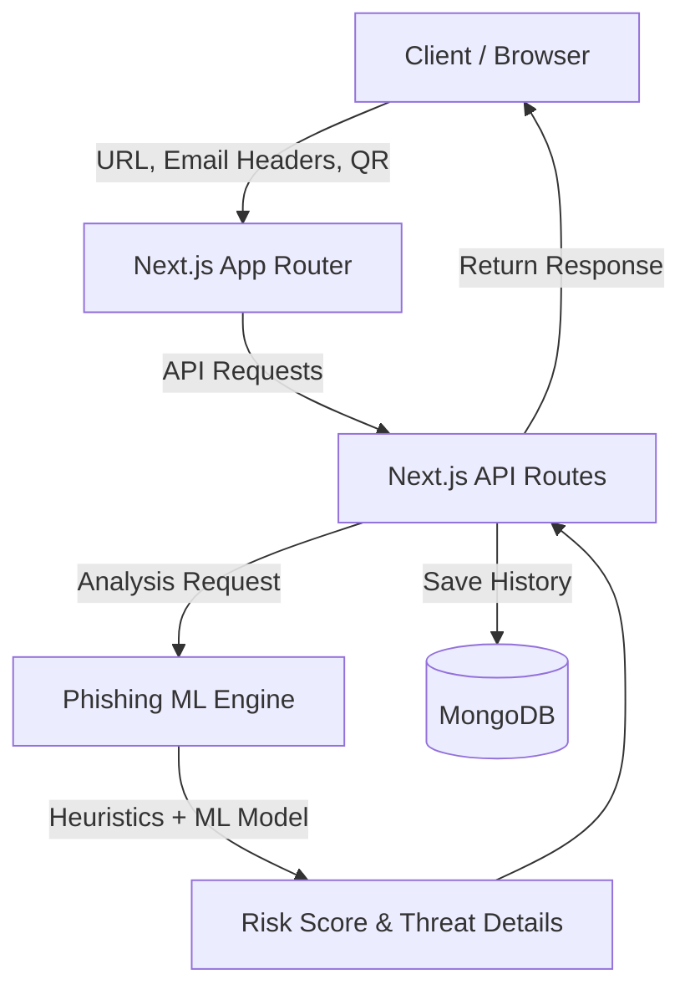

# Phish-Guard


[](https://bpl-hackathon.vercel.app/)
## Project Overview
Phish-Guard is a modern, full-stack cybersecurity web application designed to detect and prevent phishing attacks. By leveraging a combination of machine learning algorithms and advanced heuristics, it analyzes URLs, emails, and QR codes to identify malicious intent, typosquatting, brand impersonation, and other common phishing vectors. The application provides users with an intuitive dashboard to scan potential threats and view historical analytics.

## Features
- **URL Analysis**: In-depth scanning of URLs using machine learning and custom heuristics (e.g., checking for IP addresses, unusual subdomains, URL shortening services, and homograph attacks).
- **Email Header Analysis**: Parses and evaluates email headers for SPF, DKIM, and DMARC authentication failures, as well as sender domain discrepancies.
- **QR Code Scanning**: Utilizes the device's camera to scan and immediately verify the safety of URLs embedded within QR codes.
- **Brand Protection & Typosquatting Detection**: Uses Levenshtein distance algorithms and brand whitelists to detect attempts to spoof popular brands.
- **Historical Analytics**: Tracks past scans and visualizes security trends over time using interactive charts.
- **Safe Sandbox Modal**: A dedicated environment to preview or interact with potentially suspicious links safely.
- **Progressive Web App (PWA) Support**: Can be installed on mobile and desktop devices for native-like access.

## Dashboard Preview


## Technologies Used
- **Frontend Framework**: Next.js 16 (App Router)
- **UI Library**: React 19
- **Styling**: Tailwind CSS v4
- **Icons & Animations**: Lucide-React, Framer Motion
- **Database**: MongoDB (via Mongoose)
- **Data Visualization**: Recharts
- **QR Code Scanner**: HTML5-QRCode

## AI Tools & Models Used
Phish-Guard utilizes a custom, localized **Machine Learning Engine** integrated directly into the application (`phishingEngine.js`).
- **Purpose**: To provide rapid, on-device evaluation of URLs without relying entirely on external API calls, ensuring user privacy and speed.
- **How it works**: The engine extracts multiple features from a given URL (such as Shannon entropy, character ratios, sensitive keyword counts, and structural anomalies). These features are then passed through a pre-trained machine learning model (using weights stored in `phishing_model_weights.json`) to output a threat probability score.
- **Heuristics Integration**: The ML probability is combined with strict heuristic checks (e.g., detecting IDN homograph attacks or missing HTTPS) to calculate a final risk score.

## Setup & Installation Instructions

### Prerequisites
- Node.js (v18 or higher recommended)
- npm (or yarn/pnpm)
- A MongoDB database (local or cloud like MongoDB Atlas)

### Installation
1. Clone the repository or navigate to the project directory:
   ```bash
   cd phish-guard
   ```
2. Install the dependencies:
   ```bash
   npm install
   ```
3. Set up your environment variables:
   Create a `.env.local` file in the root directory and add your MongoDB connection string:
   ```env
   MONGODB_URI=your_mongodb_connection_string_here
   ```

## Usage
1. Start the development server:
   ```bash
   npm run dev
   ```
2. Open your browser and navigate to `http://localhost:3000`.
3. Use the navigation sidebar to switch between different analysis tools (URL Checker, Email Analyzer, QR Scanner).
4. Enter a suspicious URL or paste email headers into the respective tools to receive an instant safety rating and a detailed breakdown of the threat analysis.

## System Architecture



### System Design Explanation
The Phish-Guard application is built on a scalable and efficient architecture designed for rapid threat detection:

1. **Client Interface (Next.js & React 19)**: The entry point for users. It securely captures URLs, parses email headers, and utilizes the device camera for QR code scanning. The UI is highly responsive, utilizing Tailwind CSS and Framer Motion for a premium, dark-themed experience.
2. **Next.js API Routes**: Acts as the secure middle layer. It receives the payloads from the client and orchestrates the analysis workflow.
3. **Phishing ML Engine (Core Intelligence)**: A dual-layered detection mechanism located on the server:
   - **Heuristics Layer**: Instantly checks for common red flags like typosquatting (using Levenshtein distance), IP-based URLs, and missing SSL certificates.
   - **Machine Learning Layer**: Evaluates extracted features (e.g., Shannon entropy, structural anomalies) using pre-trained weights to calculate a definitive threat probability score.
4. **Data Persistence (MongoDB)**: All scan results are securely logged into MongoDB. This enables the historical analytics dashboard, allowing users to track their exposure to threats over time.

## Project Structure
```text
phish-guard/
├── src/
│   ├── app/
│   │   ├── api/            # Next.js API routes (e.g., /analyze, /history)
│   │   ├── components/     # Reusable React components (Tabs, Modals, UI elements)
│   │   ├── system/         # System pages/layouts
│   │   ├── layout.js       # Root layout component
│   │   ├── page.js         # Main application dashboard
│   │   └── PwaRegister.js  # Service worker registration for PWA
│   ├── lib/
│   │   ├── models/         # Mongoose database schemas (e.g., UrlScan.js)
│   │   ├── mongodb.js      # MongoDB connection utility
│   │   ├── phishingEngine.js             # Core logic for ML and heuristic analysis
│   │   └── phishing_model_weights.json   # Pre-trained ML model parameters
├── public/                 # Static assets (images, icons)
├── package.json            # Project metadata and dependencies
├── next.config.mjs         # Next.js configuration
└── tailwind.config.js / postcss.config.mjs # Styling configurations
```

## Important Information
- **Local Execution**: The phishing detection engine runs locally based on the provided model weights, meaning it can function effectively even in environments with limited external network access (once the site is loaded).
- **Extensibility**: The heuristics engine can be easily updated by adding new patterns to the `TOP_BRANDS`, `SHORTENERS`, or `SUSPICIOUS_TLDS` arrays in `phishingEngine.js`.

## License
This project is licensed under the MIT License - see the [LICENSE](LICENSE) file for details.
