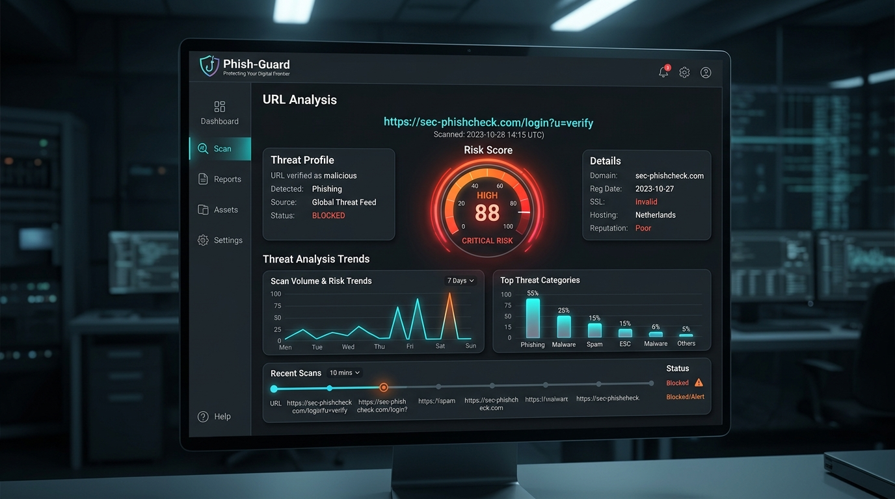
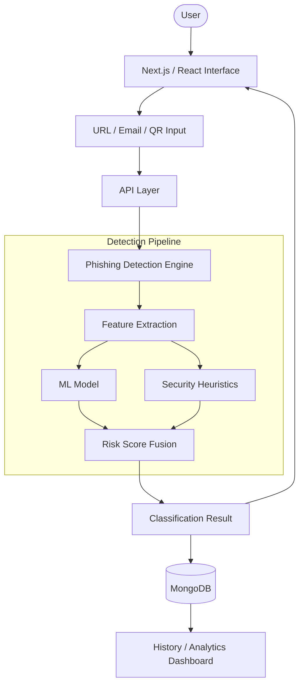

<div align="center">
  <a href="https://bpl-hackathon.vercel.app/">
    
  </a>
  
  # 🛡️ Phish-Guard

  **An Explainable, Multi-Layer Phishing Detection Platform**

  [](https://nextjs.org/)
  [](https://reactjs.org/)
  [](https://www.mongodb.com/)
  [](https://tailwindcss.com/)
  [](#license)

  [](https://bpl-hackathon.vercel.app/)
</div>

---

## 🚨 Problem Statement

Phishing attacks have evolved far beyond simple email spam. Modern threat actors employ sophisticated techniques to bypass traditional security filters and deceive users. These include:

* **Fake Domains & Typosquatting**: Visually similar URLs that mimic trusted brands.
* **Brand Impersonation**: Unauthorized use of brand names in subdomains or paths.
* **URL Shorteners**: Hiding malicious payloads behind trusted shortening services.
* **IDN Homograph Attacks**: Using look-alike Unicode characters (e.g., Cyrillic/Greek) to spoof domains.
* **Suspicious Keywords & TLDs**: Leveraging urgency and high-risk Top-Level Domains.
* **Malicious QR Codes**: Directing offline users to malicious infrastructure.
* **Email Spoofing**: Evading SPF, DKIM, and DMARC authentication.

---

## 🚀 Our Solution

Phish-Guard is an **explainable phishing detection platform** designed to provide robust security analysis while explaining *why* a threat was detected. It uses a hybrid two-layer approach:

### 1. Machine Learning Layer
Extracts critical URL features (length ratios, structural metrics, etc.) and processes them through a customized, locally executed ML model to calculate a baseline phishing probability.

### 2. Heuristic Security Layer
Applies strict, deterministic security checks to identify known phishing indicators (like Punycode homograph attacks, brand abuse, and missing HTTPS).

*Both signals contribute to the final risk assessment, ensuring high accuracy while maintaining transparency.*

---

## ✨ Key Features

### 🔍 URL Analysis
* **Structural Analysis**: HTTPS detection, IP address detection, URL/domain length, subdomain counts.
* **Linguistic Analysis**: Shannon entropy, sensitive keyword detection, character ratios.
* **Infrastructure**: Suspicious TLD detection and URL shortener detection.

### 🏢 Brand Protection
* **Trusted Brand List**: Instant verification for official, high-trust domains.
* **Brand Abuse Detection**: Identifies brand names hidden within unofficial domains.
* **Typosquatting Detection**: Uses Levenshtein distance algorithms to catch misspelled domains.

### 🔤 IDN / Homograph Detection
* **Punycode Detection**: Flags domains trying to obfuscate characters.
* **Mixed-Script Analysis**: Detects look-alike Cyrillic and Greek characters mixed with Latin scripts.

### 📧 Email Header Analysis
* Evaluates **SPF**, **DKIM**, and **DMARC** authentication results.
* Detects **From/Return-Path mismatch**.
* Identifies suspicious and urgent subject keywords.

### 📱 QR Scanner
* Seamless camera integration to scan physical QR codes and immediately pipe the decoded URL into the Phish-Guard analysis engine.

### 📊 Analytics & History
* Persistent scan history powered by MongoDB.
* Visual dashboards to track security assessments over time.

### ⚡ Progressive Web App (PWA)
* Fully installable PWA for offline-ready, app-like experiences on desktop and mobile.

---

## 📸 Screenshots

<div align="center">
  
</div>

---

## 🧠 Detection Engine

Our detection engine processes URLs through a transparent pipeline:

```
Input URL
  ↓
Feature Extraction (24 distinct features)
  ↓
Feature Standardization (Mean/Std applied)
  ↓
ML Model (Weights & Bias applied)
  ↓
ML Probability Score
  +
Security Heuristics (Deterministic checks)
  ↓
Final Risk Score
  ↓
SAFE / SUSPICIOUS / DANGEROUS
```

The core implementation lives in `src/lib/phishingEngine.js` with parameters sourced from `src/lib/phishing_model_weights.json`. 

**The Mathematical Flow:**
1. Extract numerical and boolean features from the URL.
2. Standardize each feature using stored mean and standard deviation values.
3. Multiply standardized features by their respective model weights.
4. Add the model bias to the sum ($z$).
5. Apply the sigmoid function: $P = \frac{1}{1 + e^{-z}}$.
6. Combine the ML probability with heuristic risk signals to generate the final classification.

---

## 📊 Feature Engineering

| Feature | Purpose |
| :--- | :--- |
| **URL & Domain Length** | Detect unusually long URLs often used to obscure paths. |
| **Is IP** | Detect URLs using direct IP addresses instead of domains. |
| **HTTPS** | Verify the presence of an encrypted connection. |
| **Subdomain Count** | Detect excessive nesting typical of free hosting abuse. |
| **Shannon Entropy** | Detect random-looking, auto-generated domains. |
| **Sensitive Words** | Detect credential-harvesting or urgency terms (e.g., 'login', 'secure'). |
| **Is Shortened** | Identify known URL shorteners (e.g., bit.ly). |
| **Suspicious TLD** | Flag highly abused Top-Level Domains (e.g., .zip, .tk). |
| **Typosquatting** | Detect close brand-name variations (Levenshtein distance). |
| **Brand Abuse** | Detect brand names in unofficial domain strings. |

---

## 🛡️ Heuristic Detection

| Detection | Method | Risk Signal |
| :--- | :--- | :--- |
| **IP Address** | Regex pattern matching | High |
| **URL Shortener** | Known-domain list comparison | Medium |
| **Typosquatting** | Levenshtein distance calculation | High |
| **Brand Abuse** | Brand matching outside of root domain | High |
| **Homograph** | Unicode/Punycode and mixed-script analysis | High |
| **Suspicious TLD** | Configured TLD list matching | Medium |
| **Sensitive Keywords** | Substring matching in domain and path | Medium |
| **Excessive Subdomains** | Domain structure parsing | Medium |
| **@ Symbol** | URL inspection for credential injection | High |
| **High Entropy** | Shannon entropy calculation | Medium |

---

## 🏗️ System Architecture



---

## 🛠️ Technology Stack

| Layer | Technology |
| :--- | :--- |
| **Framework** | Next.js 16.2.10 |
| **UI Library** | React 19.2.4 |
| **Styling** | Tailwind CSS v4 |
| **Animation** | Framer Motion |
| **Icons** | Lucide React |
| **Database** | MongoDB |
| **ODM** | Mongoose |
| **Charts** | Recharts |
| **QR Scanner** | HTML5-QRCode |
| **ML Inference** | Custom JavaScript-based weighted model |

---

## 📁 Project Structure

```text
phish-guard/
├── public/                 # Static assets, images, PWA manifest, and service worker
├── src/
│   ├── app/                # Next.js App Router (Pages, API Routes, Layouts)
│   └── lib/                # Core logic
│       ├── models/         # Mongoose database schemas
│       ├── mongodb.js      # Database connection utility
│       ├── phishingEngine.js             # 🧠 The core ML and Heuristics engine
│       └── phishing_model_weights.json   # Model parameters for inference
├── package.json            # Project dependencies and scripts
├── next.config.mjs         # Next.js configuration
└── README.md               # You are here
```

---

## ⚙️ Installation

To run Phish-Guard locally:

```bash
# Clone the repository
git clone https://github.com/Anmol-Malviya/BPL-hackathon-.git

# Navigate into the project directory
cd BPL-hackathon-

# Install dependencies
npm install

# Set up environment variables
# Create a .env.local file in the root directory and add:
# MONGODB_URI=your_mongodb_connection_string

# Start the development server
npm run dev
```

Visit `http://localhost:3000` in your browser.

---

## 📖 Usage

### URL Scanner
1. Enter the suspicious URL into the dashboard.
2. The engine extracts features and passes them through the ML model and heuristics checks.
3. The system generates a comprehensive **Risk Score**.
4. View the detailed breakdown of exactly *why* the URL was flagged.

### Email Analyzer
1. Paste raw email headers into the Email Analysis tool.
2. The engine parses the headers and evaluates SPF, DKIM, and DMARC alignments.
3. It checks for domain spoofing (From/Return-Path discrepancies) and urgent subject lines.
4. Review the security report.

### QR Scanner
1. Grant camera permissions when prompted.
2. Scan the physical or digital QR code.
3. The embedded URL is decoded and instantly routed through the URL Scanner pipeline.

---

## 🚦 Risk Classification

The engine calculates a Risk Score ranging from 0 to 100 based on the combined ML and heuristic outputs:

| Risk Score | Result | Description |
| :--- | :--- | :--- |
| **0 – 34** | `SAFE` | No significant phishing indicators detected. |
| **35 – 69** | `SUSPICIOUS` | Minor warnings triggered; proceed with caution. |
| **70 – 100** | `DANGEROUS` | Severe phishing indicators or confirmed attack vectors detected. |

---

## 🔎 Why Phish-Guard is Explainable

Unlike "black-box" security tools that simply output *Safe* or *Malicious*, Phish-Guard is built on the principle of explainability. 

It exposes transparent indicators to the user, such as:
* Specifically which suspicious keywords were found.
* Whether the HTTPS status is secure.
* If a raw IP address is being used to hide the host.
* The exact target of a typosquatting or brand abuse attempt.
* Identification of hidden URL shorteners.
* The calculated Shannon entropy level.
* Detected homograph attacks and their visual lookalikes.
* Clear status updates for SPF/DKIM/DMARC authentication.

This empowers users to learn about phishing tactics while securing their digital footprint.

---

## 🔒 Security & Privacy

* **Local Inference:** Core URL scoring does not require sending data to an external third-party phishing API; model weights are stored and executed locally within the application.
* **Persistent History:** MongoDB is used exclusively to store user scan history.
* **Environment Security:** Sensitive configuration (like database connection strings) belongs in `.env.local` and is never exposed to the client.
* **Disclaimer:** *No ML or heuristic-based detector can guarantee that a website is 100% safe. False positives and false negatives are possible. Users should never enter credentials into websites they do not fully trust.*

---

## ⚠️ Limitations

* **Rule-Dependent Heuristics:** Heuristic detection relies on defined rules and brand lists. New, undocumented phishing techniques may bypass existing checks.
* **False Positives:** Legitimate URLs with unusual structures (e.g., internal testing domains or complex query parameters) can occasionally trigger warnings.
* **Encryption is Not Authentication:** The presence of HTTPS indicates encrypted traffic, but it does not guarantee the legitimacy of the host.
* **Email Scope:** Email analysis depends entirely on the completeness and accuracy of the supplied raw headers.
* **QR Routing:** The QR scanner analyzes the embedded URL text; it cannot sandbox or make the final destination inherently safe.

---

## 🔮 Future Scope

While Phish-Guard is highly capable today, future improvements could include:
* **Browser Extension:** Real-time analysis of links before they are clicked.
* **Threat Intelligence Integration:** Connecting to live threat feeds for zero-day phishing detection.
* **DNS & Domain Reputation:** Querying WHOIS data for domain age and registrar trustworthiness.
* **Visual Phishing Detection:** Analyzing rendered page DOM or screenshots to detect visual brand spoofing.
* **Advanced ML Models:** Transitioning to neural networks for deeper pattern recognition and periodic model retraining based on new threat data.
* **Content Sandboxing:** Safe execution of suspicious links to analyze post-click behavior.

---

## 🤝 Contributing

Contributions are welcome! Follow these steps to contribute:

```bash
# 1. Create a new branch
git checkout -b feature/your-feature

# 2. Make your changes and ensure the build succeeds
npm run build

# 3. Commit your changes
git commit -m "Add: your feature"

# 4. Push to your branch
git push origin feature/your-feature
```
Open a Pull Request on GitHub and provide a clear description of your changes.

---

## 📄 License

This project is licensed under the MIT License. See the [LICENSE](./LICENSE) file for more details.
